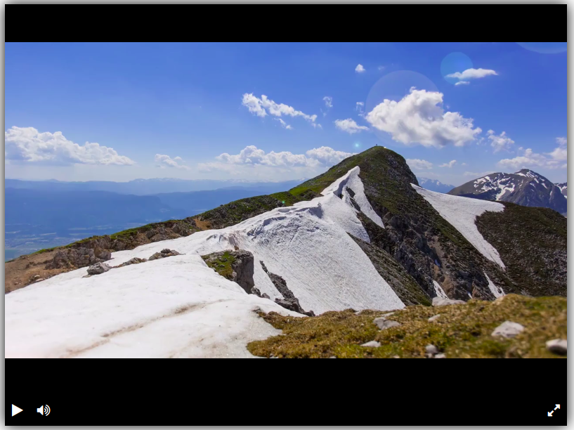

# Styling for video player 

### Выполнено в рамках урока на [dvmn](https://dvmn.org/)



### [demo](https://bfc0.github.io/video_player/)

для запуска локально:

```bash
python -m venv .venv
source .venv/bin/activate
pip install -r requirements.txt
livereload dist
```
